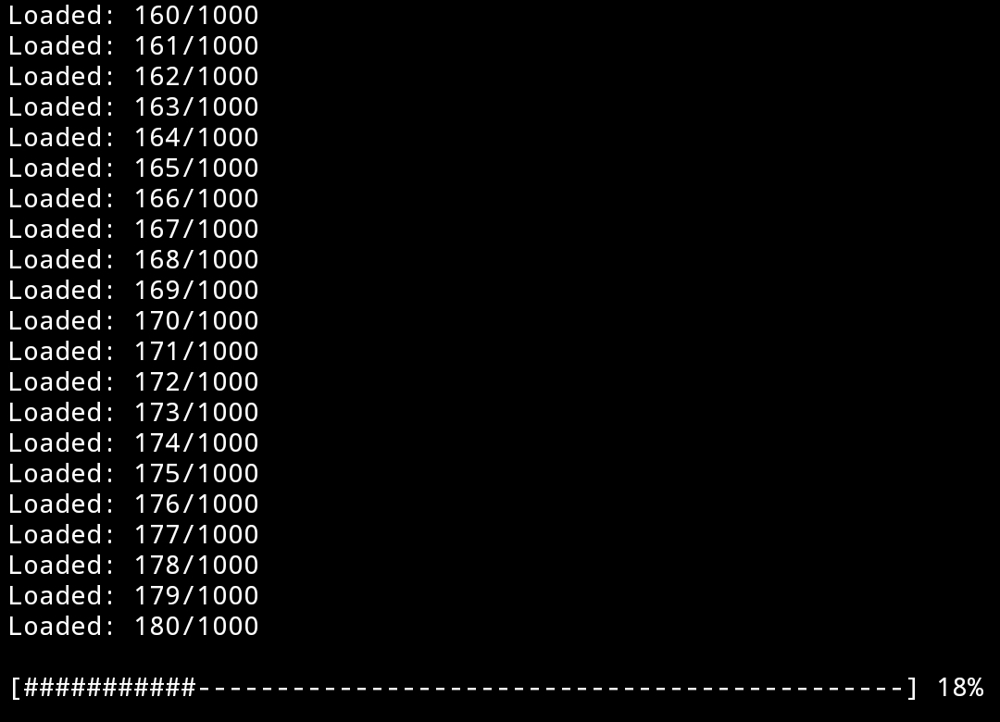

# Persistent Loading Bar
> A clean and minimal loading bar for node.js that stay's at the bottom of the screen, and that has NO dependencie's.
<p align="center">
<br>

</br>
</p>

# Example
```javascript
import loadingBar from "persistent-loading-bar";
for (let i = 0; i <= 1000; i++) {
function example(prog) {
loadingBar.setProgress(prog / 1000);
console.log("Loaded: " + prog.toString() + "/1000");
}
if (i <= 999) {
setTimeout(example, i * 10, i);
} else {
setTimeout(example, i * 10, i)
setTimeout(loadingBar.eraseBar, (i + 1) * 10);
}
}
```

# Installation
```bash
npm install persistent-loading-bar
```
